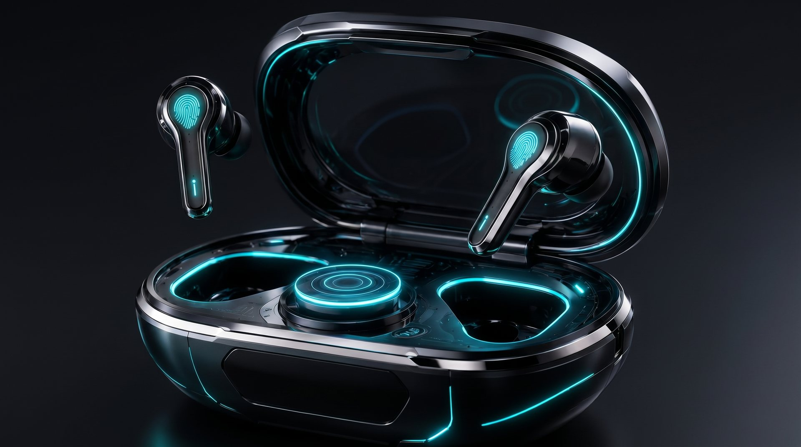

# Nikitka AI PRO

AI-assisted one-hour portfolio concept for a fictional premium headphones product.

[Live demo](https://nikitka-ai-pro-headphones.vercel.app/) | [Russian README](README.ru.md) | [Architecture](docs/architecture.md) | [Packaging audit](docs/GITHUB_PACKAGING_AUDIT.md)



> [!IMPORTANT]
> This is a fictional portfolio showcase. It is not a real product, preorder page, open-source starter, or reusable design kit.

## What This Is

Nikitka AI PRO is a static product website built to demonstrate fast AI-assisted front-end direction, asset selection, interaction design, and browser-based verification. The concept presents imaginary premium earbuds through a cinematic hero, a 3D teardown viewer, an inside-product video section, and a live radio listening demo.

The repository is meant to be reviewed as portfolio work: how the page is structured, how media is integrated, and how the final site behaves in the browser.

## What It Demonstrates

- Premium landing-page composition for a fictional consumer-tech product.
- Local optimized visual assets in AVIF, WebP, JPG, PNG, MP4, and GLB formats.
- Three.js GLB product viewer with staged case states: assembled, lid, internals, and signal path.
- Public SomaFM radio streams connected through Web Audio API controls.
- Honest product copy: the headphones and specs are fictional, while the site interactions are real.
- Static deployment to Vercel without a backend, database, auth, or secret-bearing runtime.

## Quickstart

No install step is required for the static site.

```bash
python -m http.server 4178
```

Open:

```text
http://127.0.0.1:4178/
```

## Project Structure

```text
.
├── index.html                 # Static page markup
├── style.css                  # Product UI, responsive layout, motion styling
├── app.js                     # Page interactions, video controls, radio demo
├── three-anatomy.js           # Three.js GLB case teardown viewer
├── assets/                    # Local product images, video, posters, GLB model
├── tools/                     # Blender generator for the local GLB model
├── docs/                      # Architecture, audit, and project history
└── .github/                   # Issue, PR, ownership, support, and community files
```

## Local Verification

Useful checks before publishing changes:

```bash
node --check app.js
node --check three-anatomy.js
python -m py_compile tools/create_nikitka_product_model.py
git diff --check
```

Browser verification should include:

- desktop and mobile viewport checks;
- `#product-3d` staged 3D states;
- radio controls and profile buttons;
- video playback controls;
- console errors and horizontal overflow.

## Deployment

The production site is deployed on Vercel:

```text
https://nikitka-ai-pro-headphones.vercel.app/
```

This is a static deployment. There are no server-side secrets in the repository.

## Reuse And Copyright

This repository is public for portfolio review only. It is not open source.

See [LICENSE](LICENSE). Public visibility on GitHub allows visitors to view and fork the repository through GitHub, but it does not grant permission to copy, redistribute, sublicense, sell, publish, or create derivative works from the code, visuals, 3D model, media, product name, copy, or brand concept.

For collaboration or permission requests, contact the repository owner through GitHub.

## Documentation

- [Architecture](docs/architecture.md)
- [Packaging audit](docs/GITHUB_PACKAGING_AUDIT.md)
- [Changelog](CHANGELOG.md)
- [Contributing policy](CONTRIBUTING.md)
- [Security policy](SECURITY.md)
- [Support](SUPPORT.md)
