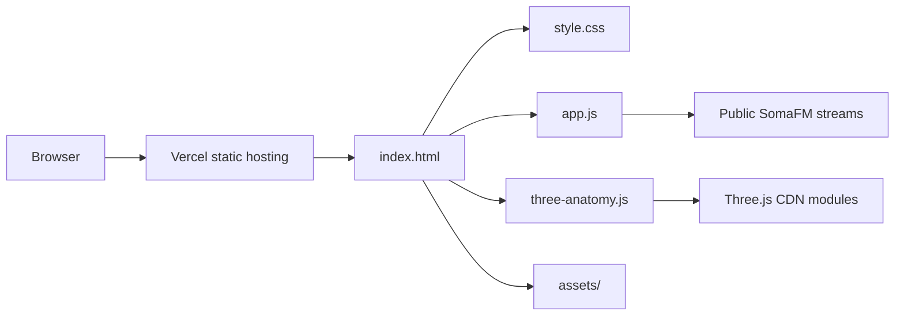

# Architecture

Nikitka AI PRO is a static browser-only portfolio site. There is no backend, database, authentication layer, or server-side build step.

## Runtime Flow



## Main Surfaces

| Surface | File(s) | Purpose |
|---|---|---|
| Product page | `index.html`, `style.css` | Static markup, layout, sections, responsive UI |
| General interactions | `app.js` | Navigation, video controls, model selectors, audio/radio logic |
| 3D anatomy | `three-anatomy.js`, `assets/nikitka-ai-pro-product.glb` | GLB loading, camera presets, staged teardown states |
| Media | `assets/*` | Local hero images, posters, MP4 video, GLB model |
| 3D source generator | `tools/create_nikitka_product_model.py` | Blender script that generates the product GLB |
| Deployment | `vercel.json` | Static deployment settings and cache headers |

## Data And External Calls

- Three.js modules are loaded through the import map from jsDelivr.
- Radio demo streams are public SomaFM MP3 stream URLs in `app.js`.
- The site does not send user data to a project backend.
- There are no private API keys in the runtime.

## Local Development

```bash
python -m http.server 4178
```

Then open:

```text
http://127.0.0.1:4178/
```

## Verification Checklist

- Load `/` and `#product-3d` in a real browser.
- Check desktop and mobile viewport behavior.
- Confirm GLB state changes for assembled, lid, internals, and signal.
- Confirm the radio player state changes without console errors.
- Confirm the inside video section renders and controls do not overlap.
- Run syntax checks:

```bash
node --check app.js
node --check three-anatomy.js
python -m py_compile tools/create_nikitka_product_model.py
git diff --check
```
